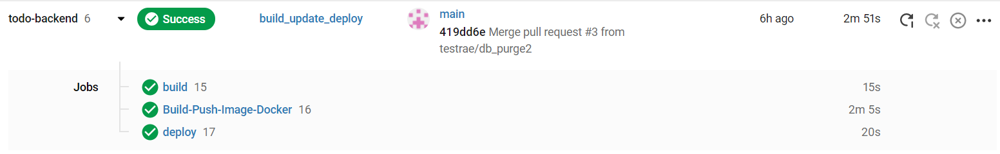

#ToDoApp Backend

It's a backend service for todoapp that uses AWS Rds postgresql server as database and CI/CD on circleci and runs on Google VM

#Built With

Django

Django REST framework

Postgresql

#Requirements Python>=3.5 Docker

#Installation

    git clone https://github.com/testrae/todo-backend.git

    pip install virtualenv

    virtualenv {venv_name}
-Mac OS / Linux

    source {venv_name}/bin/activate
Windows

    {venv_name}\Scripts\activate
    cd test

    pip install -r requirements.txt

#RUN

    docker build -t backend -f Dockerfile .

    docker run -t backend 
or

    python manage.py makemigrations

    python manage.py migrate

    python manage.py test

    python manage.py runserver

#TECH

The project pipeline

LOCAL -> Git -> CI/CD(CircleCi) -> Google VM

Any commits done to the main will be detected by circleci automated deployment

if the tests passes it'll deploy the application

Service uses CloudSQL as Postgresql server.

#Notes

Djano + Rest is a powerfull and clean method to serve backend services to Frontend

and works well with the PostgreSQL server which i have experiences of both.

The hard part was to build automation pipeline which i had no exprience of kubernetes prior

After a lot of tutorials and docs i decided to use Google Cloud services since they
were more explanatory.

Test location: rest_api/tests
Api location: rest_api/api
ToDoItem model location: rest_api/models

CircleCI build:

#prod http://34.68.208.129/rest_api/v1/